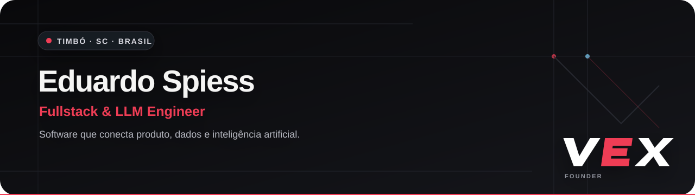

  

 

## Olá, eu sou o Eduardo.

Desenvolvedor **Fullstack e LLM Engineer** em Timbó, Santa Catarina. Construo produtos digitais que conectam aplicações web, dados e inteligência artificial — do backend e das APIs à experiência final do usuário.

Sou fundador da **[VEX](https://vexassistant.com)** e tenho foco especial em **RAG, agentes de IA, automações e aplicações orientadas por LLMs**.

- **Atuação:** desenvolvimento fullstack, integrações, RAG e agentes
- **Base:** Timbó, Santa Catarina, Brasil
- **Disponibilidade:** oportunidades CLT ou projetos PJ/MEI
- **Interesses atuais:** arquiteturas com LangChain e LangGraph

---

## O que eu construo

| Engenharia de software | Inteligência artificial | Produto e integração |
| :--- | :--- | :--- |
| Aplicações web completas | Sistemas RAG | APIs e automações |
| Frontends responsivos | Agentes orientados a ferramentas | Integração entre serviços |
| Backends e bancos de dados | Pipelines com LLMs | Prototipação e validação E2E |

## Stack principal

**Backend e dados**  
`Python` · `SQL` · `APIs REST` · `SQLite` · `RAG`

**Frontend**  
`React` · `JavaScript` · `HTML` · `CSS`

**IA aplicada**  
`LLMs` · `Agentes de IA` · `Embeddings` · `Recuperação semântica` · `Automação`

**Engenharia e entrega**  
`Git` · `GitHub` · `Linux` · `Testes E2E` · `Integrações`

---

## Projeto em destaque

### [VEX — Questionário de Entrevistas](https://github.com/eduardospiess38-dot/vex-questionario-entrevistas)

Experiência web estática para questionários de entrevistas e visualização anônima de resultados, construída com identidade visual própria da VEX.

`HTML` · `CSS` · `JavaScript` · `Produto web`

---

## Vamos conversar

Estou aberto a oportunidades em que software e inteligência artificial resolvam problemas reais de produto e operação.

[**LinkedIn**](https://www.linkedin.com/in/eduardo-spiess) · [**E-mail**](mailto:eduardospiess301@gmail.com) · [**VEX**](https://vexassistant.com)

Fullstack · LLMs · RAG · Agentes · APIs · Produto
