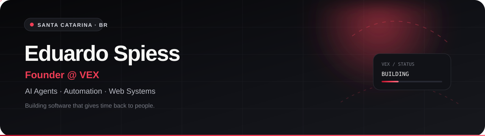

<div align="center">
  
</div>

<div align="center">
  
</div>

<div align="center">
  <a href="https://vexassistant.com"></a>
  <a href="https://www.linkedin.com/in/eduardo-spiess"></a>
  
</div>

<br />

<table>
<tr>
<td width="66%" valign="top">

## 👋 Sobre mim

Sou **Eduardo Spiess**, fundador da **VEX**. Construo agentes de IA, automações e sistemas web para transformar processos repetitivos em software útil.

Meu foco está na interseção entre **produto, engenharia de software e IA aplicada**, criando ferramentas que economizam tempo, organizam operações e ajudam empresas a produzir mais.

```text
> build useful systems
> automate repetitive work
> connect AI to real operations
> ship, measure, improve
```

### Atualmente explorando

`AI Agents` · `RAG` · `LLM Tool Use` · `Automation` · `SaaS` · `Local AI` · `Engineering Software`

</td>
<td width="34%" align="center" valign="top">
  
  <br /><br />
  <b>📍 Santa Catarina, Brasil</b><br />
  <b>⚡ Founder @ VEX</b>
</td>
</tr>
</table>

---

## 🧠 Tech Stack

<div align="center">
  
</div>

### 🤖 AI, agentes e automação

<div align="center">
  
  
  
  
  
  
  
  
</div>

---

## ⚙️ O que eu construo

<div align="center">

| AI Systems | Automation | Web Products | Engineering Tech |
| :--: | :--: | :--: | :--: |
| Agentes com ferramentas | Fluxos operacionais | SaaS e sistemas internos | Integrações BIM / IFC |
| RAG e busca semântica | Bots e integrações | APIs e dashboards | Ferramentas de cálculo |
| Modelos locais e APIs | Processos orientados por eventos | Produtos full stack | Software para engenharia |

</div>

---

## 🚀 Projetos e produtos

### 🔴 [VEX Questionário de Entrevistas](https://github.com/eduardospiess38-dot/vex-questionario-entrevistas)
Experiência web para coleta e visualização de respostas, construída com identidade própria da VEX.

`HTML` `CSS` `JavaScript` `Product Design`

### 🧩 VEX
Automações, agentes de IA e ferramentas web voltadas a ganho de tempo, eficiência operacional e crescimento.

### 🏗️ Engineering Software
Sistemas de gestão de obras, prospecção B2B, estudos de viabilidade, integração IFC e automação de rotinas técnicas.

### 🧠 Personal AI Infrastructure
Experimentação com agentes, modelos locais, tool use, voz, RAG, servidores Linux e integração entre serviços.

---

## 📊 GitHub em movimento

<div align="center">
  
  
</div>

<div align="center">
  
</div>

<div align="center">
  
</div>

---

## 🐍 Contribution Snake

<div align="center">
  <picture>
    <source media="(prefers-color-scheme: dark)" srcset="https://raw.githubusercontent.com/eduardospiess38-dot/eduardospiess38-dot/output/github-contribution-grid-snake-dark.svg" />
    <source media="(prefers-color-scheme: light)" srcset="https://raw.githubusercontent.com/eduardospiess38-dot/eduardospiess38-dot/output/github-contribution-grid-snake.svg" />
    
  </picture>
</div>

---

<div align="center">
  <h3>Software deve devolver tempo para as pessoas.</h3>
  <p>Eu construo sistemas para fazer exatamente isso.</p>
  <a href="https://vexassistant.com"></a>
</div>
